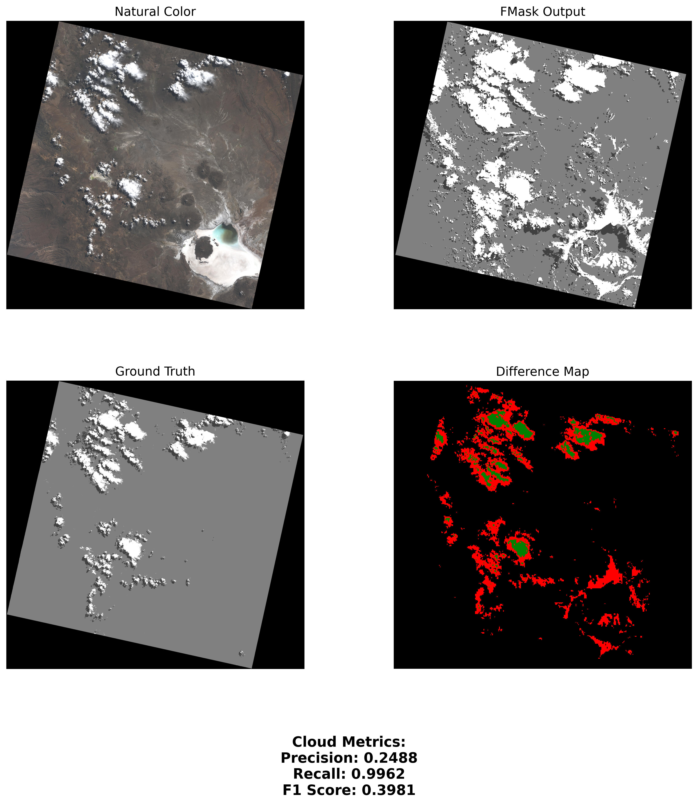

# Cloud Detection with FMask

A Python-based project for evaluating the performance of the FMask cloud detection algorithm using satellite imagery. This project processes Landsat 8 Biome datasets to generate cloud masks, ground truth data, and performance metrics, including visual summaries and statistical analyses.

---

## Features

- **Automated Processing Pipeline**: Converts raw satellite data into cloud mask evaluation data.
- **Visual Summaries**: Generates combined plots for each scene, displaying natural color, cloud masks, and performance metrics.
- **Comprehensive Metrics**: Calculates precision, recall, and F1 scores for cloud detection accuracy.
- **Portable Environment**: Fully reproducible setup using Conda and FMask.

---

## Directory Structure

```plaintext
cloud-detection-FMask/
├── scripts/
│   ├── preprocess_images.py       # Preprocess raw satellite data
│   ├── evaluate.py                # Calculate evaluation metrics
│   ├── summarize_scenes.py        # Generate visual summaries for each scene
│   ├── visualize_images.py        # Process pngs for each scene
├── data/
│   ├── raw/                       # Contains raw FMask and fixed mask files
│   ├── processed/                 # Processed outputs: fmask.png, ground_truth.png, etc.
│   ├── output/                    # Final metrics and plots
│       ├── scene_metrics.json     # Evaluation metrics for all scenes
│       ├── summary_metrics_table.png # Aggregated evaluation table
│       ├── scene_summaries/       # Combined scene summaries with metrics
├── config.yaml                    # Configuration file for paths and settings
├── example-images                 # Example outputs for scene summary and metrics table
├── environment.yml                # Conda environment setup file
├── LICENCE                        # MIT Licence
└── README.md                      # Project documentation
```

## Installation

1. Clone the repository:
```bash
git clone https://github.com/yourusername/cloud-detection-FMask.git
cd cloud-detection-FMask
```

2. Set up the Conda environment:
```bash
conda env create -f environment.yml
conda activate fmask-eval
```

3. Verify the setup:
   - Ensure `python-fmask` is correctly installed by running:
```bash
fmask_usgsLandsatStacked --help
```

---

## Configuration

Update `config.yaml` to specify your dataset paths:
```yaml
paths:
  dataset_dir: "/path/to/extracted_files"      # Original dataset
  raw_dir: "cloud-detection-FMask/data/raw"   # Raw output (FMask and fixed masks)
  processed_dir: "cloud-detection-FMask/data/processed" # Processed outputs
  output_dir: "cloud-detection-FMask/data/output"       # Final results
```

---

## Usage

### Step 1: Preprocess Images
Prepares raw satellite data, generating FMask outputs and organizing fixed masks:
```bash
python scripts/preprocess_images.py
```

### Step 2: Evaluate FMask Performance
Calculates evaluation metrics and saves results:
```bash
python scripts/evaluate.py
```

### Step 3: Create Scene Visuals
Processed raw images and outputs .png renderings:
```bash
python scripts/visualize_images.py
```

### Step 4: Summarize Scenes
Generates visual summaries for each scene, including metrics:
```bash
python scripts/summarize_scenes.py
```

---

## Outputs

- **Scene Metrics**: Saved as `scene_metrics.json` in the output directory.
- **Aggregated Metrics Table**: A PNG summary of metrics saved as `summary_metrics_table.png`.
- **Scene Summaries**: Combined plots for each scene in the `scene_summaries/` directory.

---

## Example Outputs

### Scene Summary Example
Each scene produces a combined plot like this:



### Metrics Table Example
Aggregated metrics for all scenes:


---

## Contributing

Contributions are welcome! Feel free to open issues or submit pull requests to improve the project.

---

## License

This project is licensed under the [MIT License](LICENSE).

---

## Acknowledgments

- **FMask Tool**: [https://github.com/ubarsc/python-fmask/releases](https://github.com/ubarsc/python-fmask/releases)
- **Landsat 8 Biome Dataset**: [https://landsat.usgs.gov/landsat-8-cloud-cover-assessment-validation-data](https://landsat.usgs.gov/landsat-8-cloud-cover-assessment-validation-data)
- **Dependency Management**: Thanks to Conda and the open-source Python community.